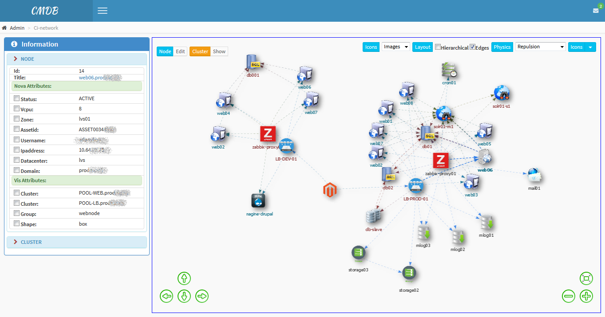

# CMDB #

> Configuration Management Database

  
Network connections overview

  

    
  

  
Hierarchical Network View

  

    
  

  
Network View with shapes as icons

  

    
  

  
Network View with images as icons

  

    
  

  
Hierarchical Network View with images as icons

  

    
  

  
Configuration Items list

  

    
  

  
Configuration Item edit dialog

  

    
  

> :calendar: Developed in **2015**

---

:scorpion:
