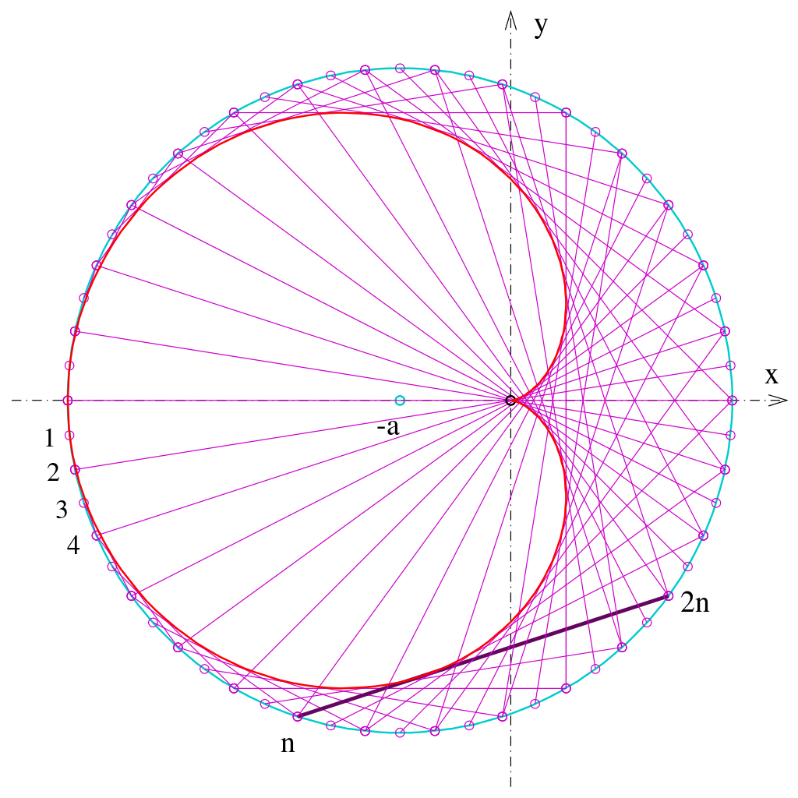

# Elegant Curve Generated by Chords #

> Элегантная кривая, порождённая хордами

  
Cardioid as envelope of a pencil of lines

  

    
  

Реализация [алгоритма](https://github.com/tbaltrushaitis/elegant-curve) построения [кардиоиды](https://en.wikipedia.org/wiki/Cardioid) хордами

> :calendar: Developed on **12th of June 2020**

---

:scorpius:
